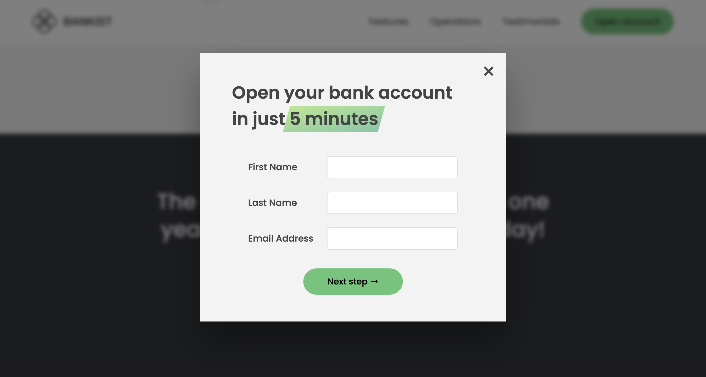

## 🏦 Easy Bank
Easy Bank is a simulation project that replicates a modern banking interface. It is implemented using HTML, CSS, and JavaScript and provides functionalities such as modal windows and page scrolling.This project is bulit while learning JavaScript with Jonas's tutorials.

## 🚀 Features
Modern Interface: Designed with a sleek and modern layout, replicating the feel of an online banking system.
Modal Windows: Open and close modal windows to interact with different features.
Page Scrolling: Smooth scrolling to different sections of the page.
CSS and JavaScript Interaction: Demonstrates how to dynamically change styles and interact with CSS variables using JavaScript.

## 🎮 How to Access
Open the App: Open index.html in your preferred browser.

## 💻 Setup and Running
Download or clone the repository.
Open index.html in your preferred browser.
No server or additional setup required.

## Some Screenshots:

